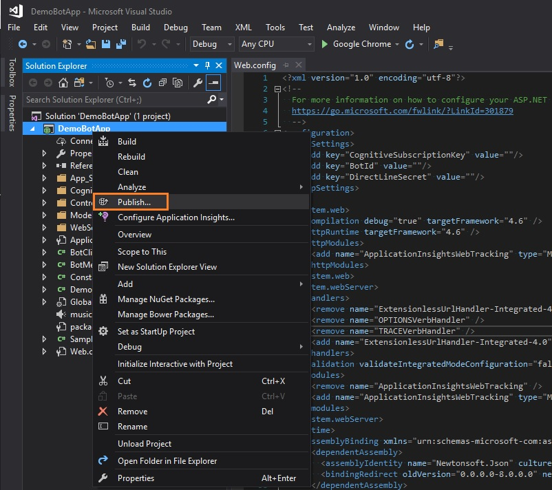
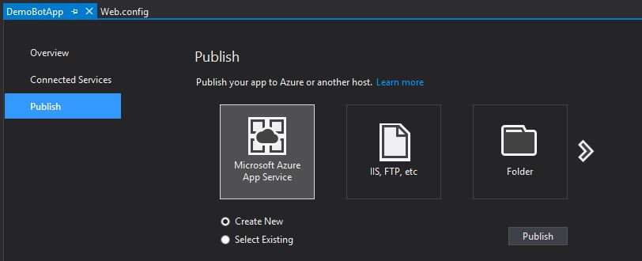
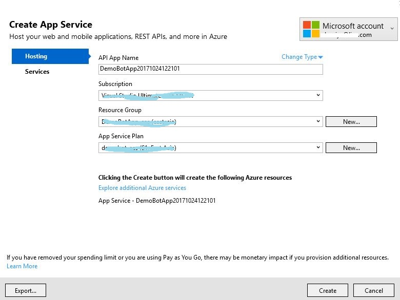
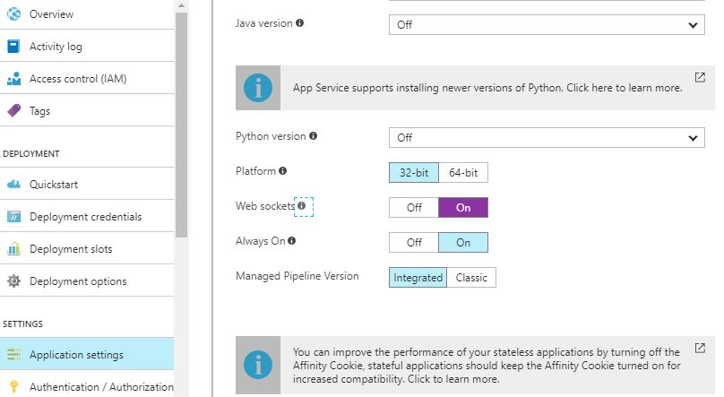
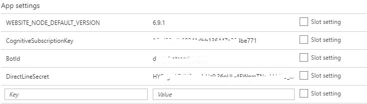

# DevKitChatBot

## 开始
1. 根据 [Get Started](https://microsoft.github.io/azure-iot-developer-kit/docs/get-started/) 搭建开发环境
1. 安装 [Visual Studio 2017] (https://docs.microsoft.com/en-us/visualstudio/install/install-visual-studio)
1. `git clone https://github.com/DevKitExamples/DevKitChatBot`
1. `cd DevKitChatBot`

## 创建WebSocket服务
1. 进入Web App本地源代码目录
```
cd DemoBotApp
start .
```

2. 双击 DemoBotApp.sln 用VS 2017打开解决方案
3. 按下F6键执行编译 （或选择Build -> Build solution）
4. 选择项目文件右键点击Publish进行发布

    

5. 选择创建一个新的Web服务实例

    

6. 配置Web服务实例，包含服务名，选择的Azure Subscription, Resource Group, App Service Plan等。然后点击**Create**按钮部署Web服务

    

7. 打开浏览器并输入：[https://portal.azure.cn](https://portal.azure.cn)

8. 打开Application settings, 开启Web sockets协议支持

    
9. 打开Application settings, 将以下三个配置项填写的

    CognitiveSubscriptionKey: XXX
    BotId: XXX
    DirectLineSecret: XXX

    

10. 保存并重启Web服务使配置生效

## 将Arduino Sketch上传到DevKit

1. 进入示例程序本地源代码目录,并用Visual Studio Code打开该目录:
```
cd ..\ChatBot
code .
```

2. 将部署好的Web服务名称替换到*DevKitChatBot.ino*中 **[your web app name]**
   
   `static char * webAppUrl = "ws://[your web app name].azurewebsites.net";`

3. 将DevKit连接到电脑上
4. 在Visual Stuio Code中，通过`Crtl P`启动任务窗口， 输入`task device-upload`并回车。
5. Visual Studio Code会编译并上传Arduino Sketch，请耐心等待，整个过程会持续几分钟。

## 运行对话机器人
1. 上传结束后DevKit会自动重启，网络配置请参考课程一。
2. 在网络连接成功后，按下按钮A开启对话模式。 
3. 按住按钮B开始说话，说完松开按钮B
4. 等待语音处理

测试对话集：
1. Hello / Good morning / How do you do
2. Could you introduce yourself?
3. Do you know Microsoft?
4. Who is Bill Gates?
5. How is the weather in Shanghai? / What's the weather like in Paris? / Tell me the weather in Los Angles.
6. Come some music please. / Could you play some music