# DevKit Chat Bot

## Overview
This is a proof of concept to use IoT DevKit to build an intelligent chat bot with Azure AI services. This example will use the built-in audio codec in IoT DevKit to record and playback audio, and leverage Azure cognitive services and bot service to build an intelligent chat bot which can understand user utterances.

## Prerequisites
1. Setup IoT DevKit development environment by following [Get Started](https://microsoft.github.io/azure-iot-developer-kit/docs/get-started/) and have your DevKit connect to Wi-Fi.
2. Install [Visual Studio 2017](https://docs.microsoft.com/en-us/visualstudio/install/install-visual-studio)
3. `git clone https://github.com/DevKitExamples/DevKitChatBot` 
4. `cd DevKitChatBot`

## Step 1: Create Bot Service
1. Log in to the [Azure portal](http://portal.azure.com/).

    > **Note**: If you do not already have a subscription, you can register for a [free account](https://azure.microsoft.com/en-us/free/).

2. Click **Create new resource** link found on the upper left-hand corner of the Azure portal, then select **AI + Cognitive Services > Web App bot**. A new blade will open with information about the **Web App Bot**.

3. In the **Bot Service** blade, provide the requested information about your bot as specified in the table below the image.

    > **Note**: please choose the **Language understanding** (C#) as your bot template.

    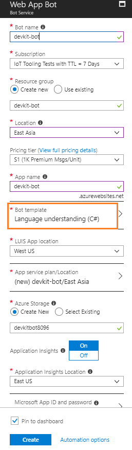

4. Click **Create** to create the service and deploy the bot to the cloud. This process may take several minutes.

5. When the bot servie is created, you can test it in Web Chat from Azure Portal. Enter a creeting message and your bot should give the response.

    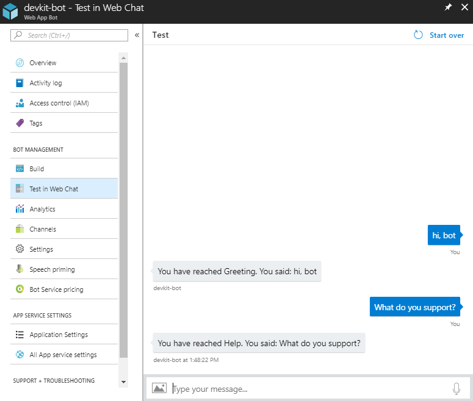

## Step 2: Edit and publish LUIS application
In previous steps, you've created a bot using the Language understanding template, Bot Service creates a corresponding LUIS application that is empty (i.e., that always returns None). To update your LUIS application model so that it is capable of interpreting user input, you must sign-in to [LUIS](https://www.luis.ai/), click **My applications**, select the application that the service created for you, and then create *intents*, specify *entities*, and *train* the application, and finally *publish* to the production.

Please follow the steps below to update your LUIS application:
1. Add intents
    
    In your LUIS app, from the **Build** section, then click **Intents** in the left panel. On the Intents page, click **Create new intent**. In the **Create new intent** dialog box, type the intent name and click **Done**. In this example, we will create 3 new intent for the LUIS application:

    - **Info.General** - handing request for some general information ask.
    - **Info.GetWeather** - getting weather forecast for a city.
    - **Music.Play** - playing music on IoT DevKit.

    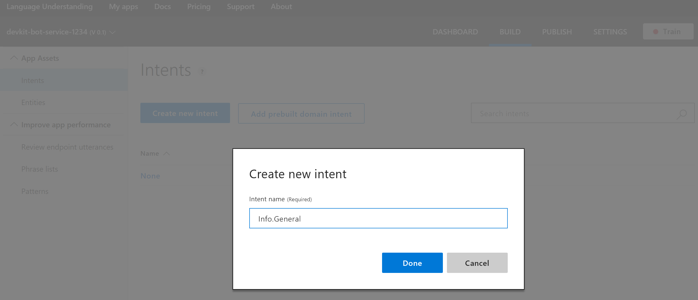

2. Add entities

    In your LUIS app, from the **Build** section, then click **Entities** in the left panel. On the Entities page, click **Create new intent**. In the **Create new intent** dialog box, type the intent name and click **Done**. In this examples, we will create 2 entities:

    - **Info.Keyword** - the information keyword in a help request
    - **city** - the name of the city

    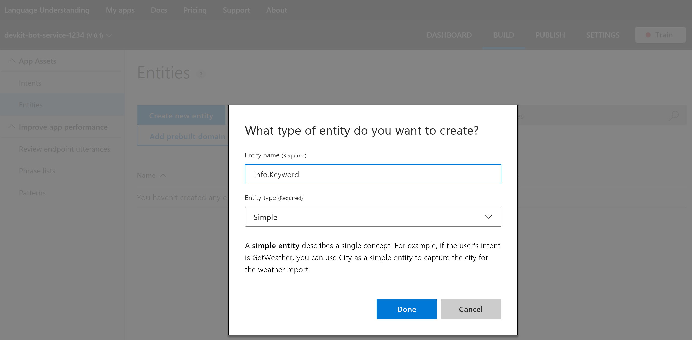

3. Add utterances

    Add utterances to the above intents that you expect a user to ask for, and lable the entity in the utterance:

    - Add the following utterances for **Info.General** intent, and label the highlighted terms as **Info.Keyword** entity:

        - *Could you introduce **yourself**?*
        - *Do you know **Bill Gates**?*
        - *Tell me something about **Microsoft**?*  

    - Add the following utterance for **Info.GetWeather** intent, and label the highlighted terms as **city** entity:
        - *What's the weather like in **Shanghai**?*
        - *How is the weather in **Rome** today?*
        - *Tell me the weather in **Paris***

    - Add the following utterances for **Music.Play** intent:
        - *Could you play some music?*
        - *Come some music, please*
        - *Give me some music*

    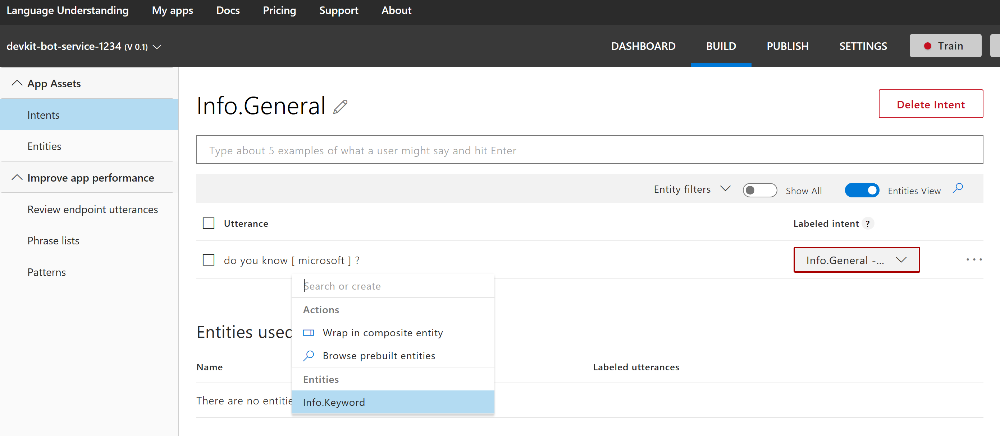

4. Train the app

    In the top right side of the LUIS website, select the **Train** button.

    

5. Publish the app

    In the top right side of the LUIS website, select the **Publish** button. Select the Production slot and the **Publish** button. Publishing is complete when you see the green status bar at the top of the website confirming success.

## Step 3: Edit and republish bot service

1. Download the publushing settings file from [Azure Portal](https://ms.portal.azure.com/).

    - Navigate to the bot service you've created in previous steps, and click **All App service settings** tab.

        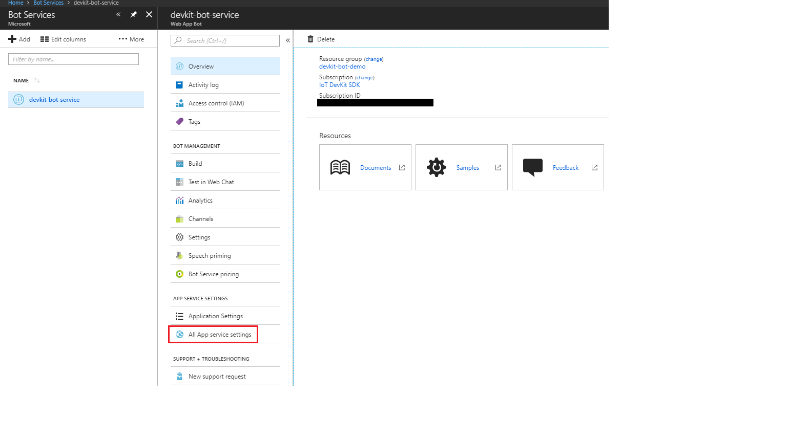

    - Click **Get publish profile** tab on the right side of the website's blade. This will download a `{websitename}.PublishSettings` file to your local computer storage.

        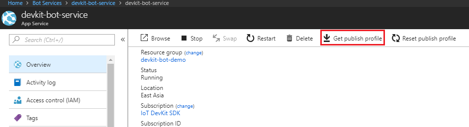

2. Launch **Visual Studio 2017** and open the bot service solution file *Microsoft.Bot.Sample.LuisBot.sln* under folder *devkit-bot-service*.

3. Right click on the project file and select **Publish** tab.

4. In the Publish wizard window, click the **Import Profile...** button at the bottom left, and select publish profile file you've just download.

    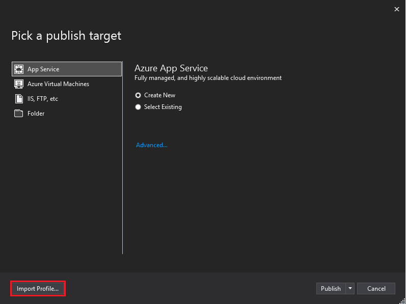

5. Wait a few seconds to finish the Azure deployment.

## Step 4: Setup WebSocket agent

1. Follow the instuction [here](https://docs.microsoft.com/en-us/azure/app-service/environment/app-service-web-how-to-create-a-web-app-in-an-ase) to provision an **Azure Web App** from Azure portal. 

2. Config app settings of the Azure Web App:

    - In Azure portal, go to the Azure Web App you've just created, select **Application settings** tab

    - In **General settings** section, enable **Web sockets** connection for your Azure Web App.

        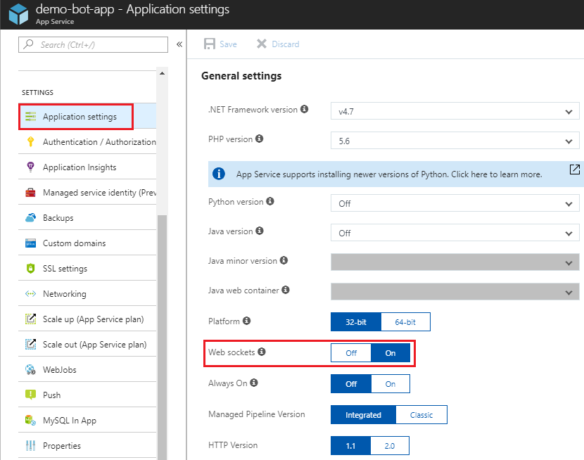
    
    - In **Application settings** section, add three settings as follows:
        
        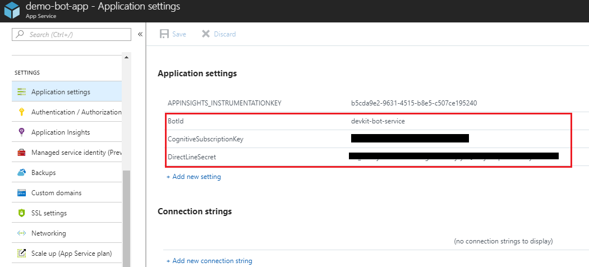

        - **CognitiveSubscriptionKey** - API access key to the Cognitive Bing Speech APIs.

            The Speech API is part of Cognitive Services. You can get free trial subscription keys from the [Cognitive Services subscription](https://azure.microsoft.com/try/cognitive-services/) page. After you select the Speech API, select Get API Key to get the key. It returns a primary and secondary key. Both keys are tied to the same quota, so you can use either key.

        - **BotId** - Name of the bot service created in [Step 1: Create Bot Service](#Step-1:-Create-Bot-Service).
        
        - **DirectLineSecret** - Direct Line secret to the Direct Line channel of the bot service.
            
            Go to the bot service in Azure portal, click **Channels** tab, Copy the secret key and save in your favorate note, then click **Done** button. For more details, please refer to this [instruction](https://docs.microsoft.com/en-us/azure/bot-service/bot-service-channel-connect-directline?view=azure-bot-service-3.0).

            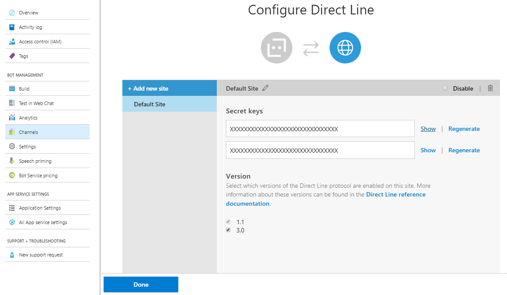

3. In Azure portal, download the *publushing settings* file of the azure web app you've just created.

4. Launch **Visual Studio 2017** and open the WebSocket web app solution file *DemoBotApp.sln* under folder *demo-bot-app*.

5. Right click on the project file and select **Publish** tab.

6. In the Publish wizard window, click the **Import Profile...** button at the bottom left, and select publish profile file you've just download.

7. Wait a few seconds to finish the Azure deployment.

## Step 5: build and upload device application to the DevKit

1. Navigate to the **device-app** folder in the root of your local repo, and open this folder with *Visual Studio Code*.

2. Connect the IoT DevKit to your computer via Micro-USB cable.

3. Open **device-app.ino**. Find and replace `[web-app-name]` with the Azure Web App name you've create in Step 4.

    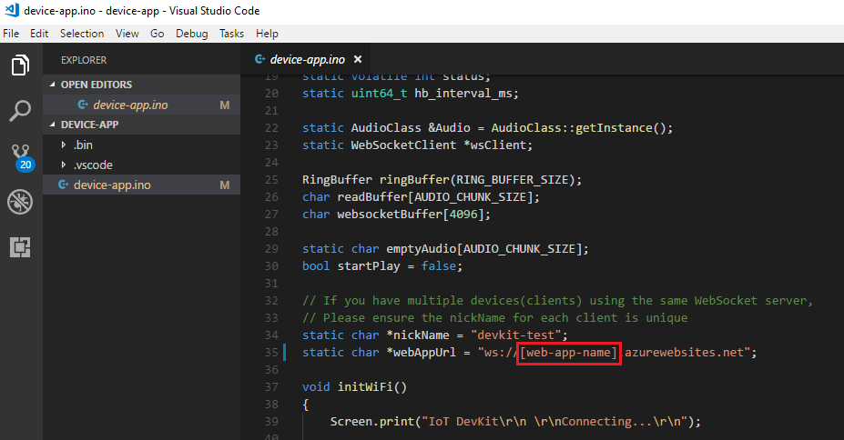

4. Use Quick Open in VS Code (Windows: `Ctrl+P`, macOS: `Cmd+P`) and type `task device-upload` to build and upload the code to the DevKit.

5. The output window shows whether the task was successful.

## Play with the chat bot

1. Press **Reset** button on the DevKit to restart your device application.

    *Note: Please ensure your DevKit is connected to Wi-Fi.*

2. After the DevKit connect to Wi-Fi successfully, press button A to start a convercation.

3. Hold down button B to talk, and release button B when you finish your voice command.

4. Wait a few seconds for service to process the voice command.

5. The DevKit will play back the response audio via the headphone output on your DevKit. You can hear the audio via headphone connected to it.

### Test utterance

- *Hello / Good morning / How do you do?*
- *Could you introduce yourself?*
- *Do you know Microsoft?*
- *Who is Bill Gates?*
- *How is the weather in Shanghai? / What's the weather like in Paris? / Tell me the weather in Los Angles.*
- *Come some music please. / Could you play some music？*
